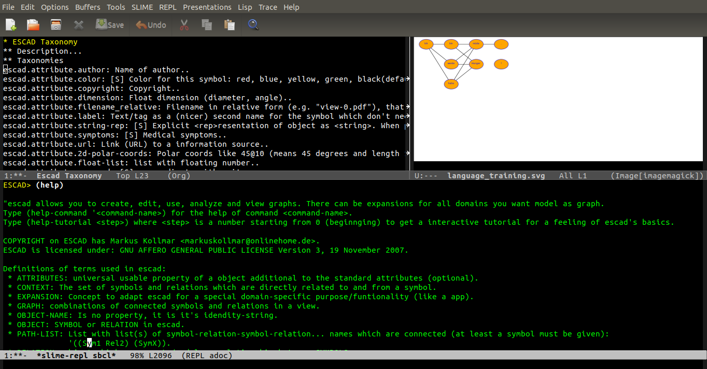

# Welcome to ESCAD.

ESCAD stands for **E**xpandable **S**ymbolic **C**omputer **A**ided **D**escription. It is a tool in common-lisp which allows you to model parts of the world in symbols and relations, which are combined to a graph.

After modeling the graph, you can generate useful content (like PDF, SVG, DOT,...) from the graph or extract informations. The whole system is extendable through domain specific (self-written or existing) expansions, so you are not limited to the predefined shipped expansion-functions.

# State

Escad is in basic development state. Currently there is no released version. Just clone the current repository and try it. Note that not all parts are working yet and interfaces may change over time. Multiple user interfaces are planed. Currently the terminal or emacs is the best choice.

# Getting started

Visit the [PDF-manual](./doc/escad_manual.pdf) for usage, user stories or a tutorial. Since escad is developed documentation-driven, this manual is the specification what should be achieved. However it lives like the code, so you should regularly check it.

# COPYRIGHT

COPYRIGHT on ESCAD has Markus Kollmar (Germany).
ESCAD is licensed: GNU AFFERO GENERAL PUBLIC LICENSE Version 3, 19 November 2007.