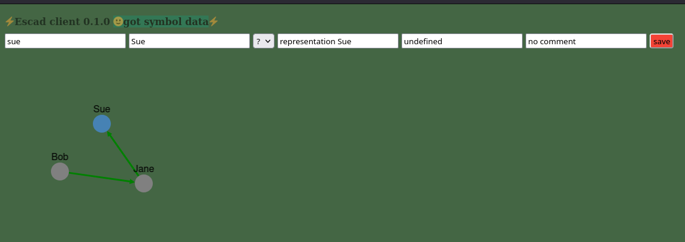
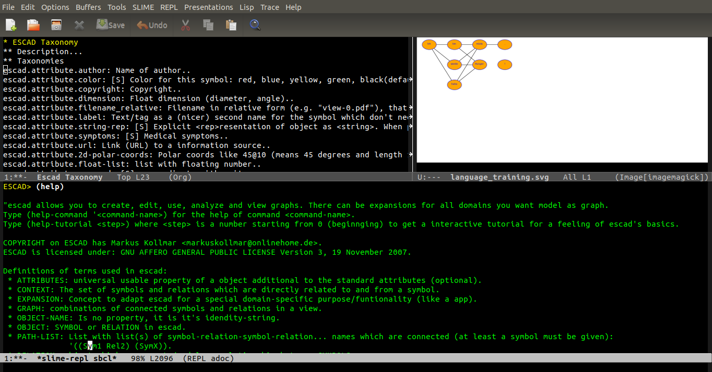

# Welcome to ESCAD.

ESCAD stands for **E**xpandable **S**ymbolic **C**omputer **A**ided **D**escription. It is a tool basically written in common-lisp which allows you to model parts of the world in a graph (symbols and relations). Unlike some (still common) workflows which need the switching to different software tools and probably erroneous reentering of data, escad in principal (with domain expansions) allows model it once and do as many tasks as possible in escad.

After modeling the graph, you can generate content (like PDF, SVG, DOT,...) from the graph or extract informations. The whole system is extendable through domain specific (self-written or existing) expansions, so you are not limited to the predefined shipped expansion-functions. You need an example what escad exactly is about? Then read the next section with an practical use case.

# Use case example "room planing"

Imagine you plan to fetch an cabinet for your living room or a machine for your workshop. Before you need to figure out the best position for the cabinet or machine and to make sure there is enough space for it. For your wife or your boss you have to create a small PDF document with some solutions so that you could together make a decision if or where to place the cabinet or the machine.

Without special tools you may first draw a two-dimensional drawing of the situation and figure out some solutions. You use a drawing programm and generate some pictures. This pictures you insert in a office-document-program and you enter some description. At the end you generate a PDF-document.

However your wife or your boss say you did a great job, but they are concerned about the third-dimension. They want to see if and how it fits into the three-dimensional space of the living room or the workshop. You now maybe have to reenter the data in a other program which is able to handle three dimensional data. Maybe you first have to learn it, but even then you have to generate new images for your office-document-program.

Now you are finished and all are happy. But consider if you have to fetch more furnitures or machines and your wife or your boss need a table filled with properties of furniture or machines to get an overview and a total amount of price. In this case you have to reedit your office-docment and to make sure you have consistent data like unique name for the furnitures or machines to properly name them in the pictures and the table.

Imagine instead of the described situation you would have instead following situation:

* You have **one** program where you can work in.
* You enter or link the needed **data one single time**.
* At **new tasks you can stay in this one program** which you are familiar with. To generate a new PDF you not need to switch to different program to first generate new images.
* Also if you want change the property of a furniture or machine (e. g. the height) you not want to do it several times in your document (e. g. in the 3d-model and the property table). You need in general a way to **symbolical describe** your problem and then to have tools which generate a output of it (in our case a PDF).
* If you need a 3D-data of one of your furniture or machine later, you simply want generate it without enter already given data or you want to import data in some 3D-format. If this functions would be not integrated yet in the tool, you may want (or let) write it yourself and thus **expand the tool** to your needs.
* The data is stored in open format in **unicode text**.

Imagine there would be such a program with such aims! Maybe you have found it here with **ESCAD**! ;-)

# State

Escad is in basic development state. Currently there is no released version and nor is it guaranted to work (or just partly) after download! However the development follows the document driven development approach. Thus currently the activities are to prepare the manual and, controlled by it, also the code for the version 0.1 release.

Just clone the current repository and look at it. There are basically two two ways to use escad. The easiest way is to start the browser and use the graphical gui.

Experienced user can use the commandline (or the scripting possibility) and directly write lisp code.

# Getting started

Visit the [PDF-manual](./doc/escad_manual.pdf) for usage, user stories or a tutorial. Since escad is developed documentation-driven, this manual is the specification what should be in the first release. However it lives like the code, so you should regularly check it.

# COPYRIGHT

COPYRIGHT on ESCAD has Markus Kollmar (Germany).
ESCAD is licensed: GNU AFFERO GENERAL PUBLIC LICENSE Version 3, 19 November 2007.
